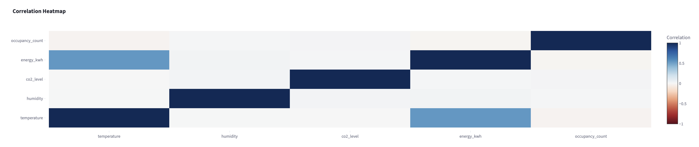
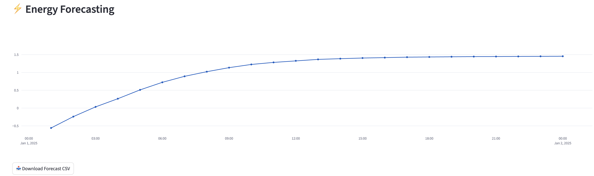
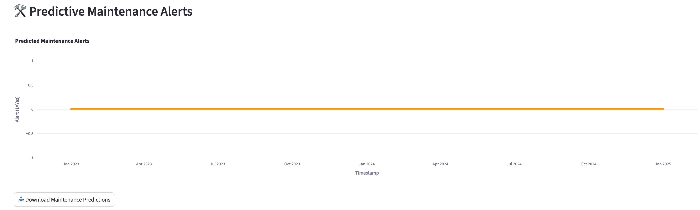
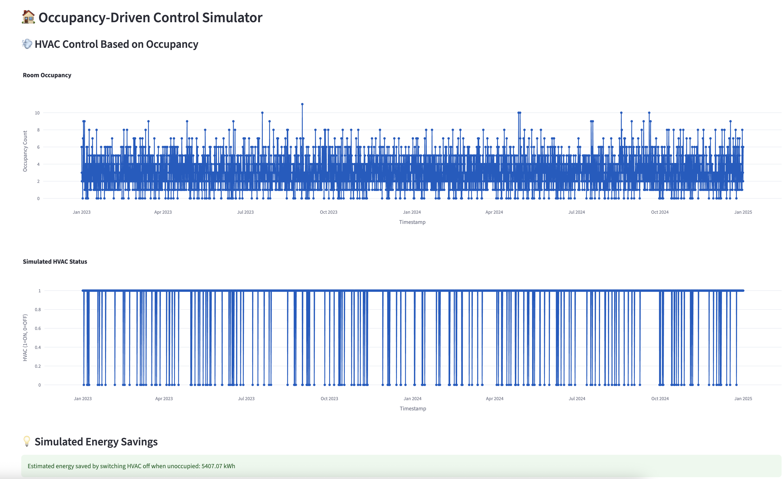

# 🏥 NHS Smart Hospital Dashboard Project

This project is a **Streamlit-based dashboard** that visualizes environmental sensor data from a dummy NHS smart hospital dataset. It includes:

- ✅ Exploratory Data Analysis (EDA)
- ⚡ Energy Forecasting using RNN
- 🚨 Anomaly Detection using LSTM Autoencoder
- 🛠️ Predictive Maintenance Alerts using Machine Learning
- 🧠 Occupancy-Driven HVAC Control Simulator

> 🔬 **Note**: This dashboard is built with dummy data. It demonstrates AI-powered functionalities that can be adapted to real NHS hospital environments with proper integration of operational, maintenance and spatial datasets.

---

## 📊 1. Exploratory Data Analysis (EDA)

We visualise sensor trends and correlations for:
- Temperature
- Humidity
- CO₂ Levels
- Energy (kWh)
- Occupancy Count

---

## ⚡ 2. Energy Forecasting

- Uses a **Recurrent Neural Network (RNN)** to predict next 24 hours of energy consumption.
- Model trained on time-windowed environmental and occupancy features.

---

## 🚨 3. LSTM-Based Anomaly Detection

- Employs a **Deep Learning LSTM Autoencoder** to detect anomalies in environmental patterns.
- High reconstruction error = Potential sensor/system abnormality.

---

## 🛠️ 4. Predictive Maintenance

- Uses a **Binary Classifier** trained on sensor features to flag devices/systems likely needing maintenance.
- Can be extended to include historical maintenance records.

---

## 💡 5. Occupancy-Driven Control Simulator

- HVAC control logic: If `occupancy_count = 0` → HVAC = OFF
- Forecasts potential **energy savings** from this rule
- Useful for testing automated building management policies

---

## 🧠 Future Research Directions

This dashboard prototype can be expanded into a comprehensive **AI-driven facility management system** for NHS smart hospitals. Potential future work includes:

- 🏗 Integration of **spatial and layout data** (e.g., BIM models, room functions)
- 🌦 Coupling with **weather forecast APIs** for smarter HVAC scheduling
- 🩺 Incorporating **maintenance records**, **equipment usage logs** and **asset tags**
- 📡 Real-time **IoT integration** with edge AI processing
- 🧩 Deploying **digital twin frameworks** for simulation and scenario testing
- 🤖 Implementing **AI agents** for autonomous control, diagnostics and energy optimisation
- 🔄 Using **federated learning** for decentralised model updates across multiple NHS facilities

---

## 🗃️ Model Management

All ML/DL models are stored in the `/models` folder:
- `rnn_energy_forecasting_model.keras`
- `lstm_anomaly_model.keras`
- `maintenance_classifier.pkl`
- `maintenance_scaler.pkl`

---

## 👨‍🔬 Developed by

**Loughborough University Research Team**  
- Dr. Seongha Hwang  
- Prof. Chris Gorse  
- Prof. Sergio Cavalaro

---

## ⚠️ Disclaimer

This dashboard is for **educational and research purposes only**. All data is **synthetically generated** and not linked to any real NHS patient or hospital infrastructure.

---